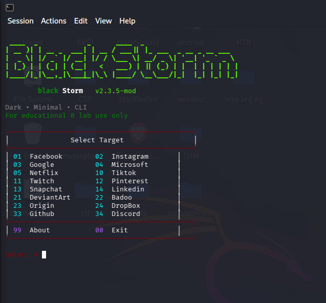
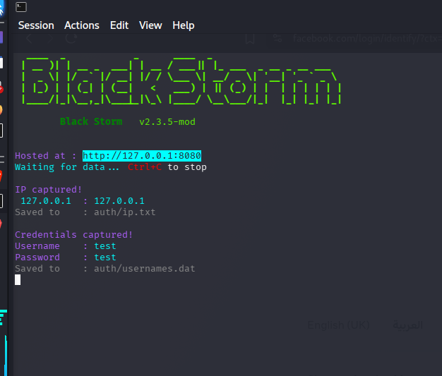

<!-- Black Storm -->

<h1 align="center">Black Storm</h1>

  <b>PHISHING TOOL . SOCIAL ENGINERRING</b> 
  <i>Educational terminal-based framework for learning phishing concepts</i>

  
  
  

---

## 🖤 About Black Storm

**Black Storm** is a **custom educational CLI framework** inspired by existing open-source projects, designed to help learners **understand how phishing attacks work from a defensive and analytical perspective**.

This project focuses on:
- Terminal UI / UX
- Visual clarity
- Clean banners and menus
- Simplifying complex ideas for beginners

> ⚠️ Black Storm is **not intended to be used for real-world attacks**.  
> Its purpose is to **demonstrate phishing mechanics in a controlled learning environment**.

---

  

  

## 🎯 What Does Black Storm Teach About Phishing?

Black Storm helps learners understand phishing by demonstrating **how attackers think and operate**, without encouraging misuse.

### Through this project, you learn:

- 🔹 **How phishing pages look and behave**
- 🔹 **Why users fall for fake login pages**
- 🔹 **How credentials can be captured if users are careless**
- 🔹 **The importance of HTTPS, URL validation, and user awareness**
- 🔹 **How tunneling and exposure concepts work at a high level**
- 🔹 **Why security awareness training is critical**

In short:
> **To defend against phishing, you must first understand how it works.**

---

## 🧠 Educational Use Case

Black Storm is useful for:

- Cybersecurity students  
- Ethical hacking learners  
- Blue team & SOC beginners  
- Security awareness demonstrations  
- Lab-based learning environments  

It is especially helpful for:
- Understanding **social engineering**
- Recognizing **fake login portals**
- Learning **why phishing is effective**
- Improving **user-side and defensive security mindset**

---

## ✨ Features

- ✔️ profitional fake pages 
- ✔️ work on the localhost  
- ✔️ work over LAN using cloudflare and ngrok  
- ✔️ spable connection 
- ✔️ frindly GUI   
- ✔️ multiply sessions     

> This version emphasizes **visual clarity and learning**, not automation power.

---

## 🖥️ Preview

---

## ⚙️ Technical Notes

- Written in **Bash**
- Designed for **xterm-256color** compatible terminals
- Best experience on:
  - VS Code Terminal
  - Terminator
  - Alacritty
  - Termux (with proper color support)

---

## ⚠️ Disclaimer (Important)

This project is provided **for educational purposes only**.

- Any actions taken using this project are **the sole responsibility of the user**
- The author and contributors are **not responsible for misuse**
- Do **NOT** use this project to:
  - Steal credentials
  - Impersonate individuals or services
  - Violate laws or privacy
- Always follow the laws of your country and ethical guidelines

If your intention is malicious or illegal — **do not use this project**.

---

## 🙏 Credits

- Inspired by open-source educational tools
- FIGLET fonts for ASCII banners
- The cybersecurity learning community

This is a **UI-focused educational modification**, not an official or production-grade security tool.

---

## 📄 License

This project follows open-source principles.  
Respect original authorship and use responsibly.

---

  <b>Black Storm</b> 
  <i>Learn how phishing works — so you can stop it.</i>

